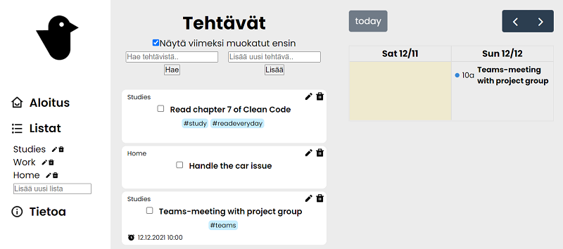

# My very first React application



A basic todo-application made as a course project.

## Features

* Add, edit and delete todos and todo lists (collections)
* View multiple lists simultaneously
* Sort manually with [beautiful-dnd](https://www.npmjs.com/package/react-beautiful-dnd)
* Add alarms to todos (and get toast notifications)
* View todos in [FullCalendar](https://fullcalendar.io/), if alarm is set
* Filter by text and tags

## Technology

* **Frontend**
  * React
  * React Redux
* **Backend**
  * `json-server` with a local JSON database

## Installation

Clone the repository: `git clone https://github.com/roouit/my-first-react-app.git`

Install dependencies: `npm install`

Make sure you have a file named `db.json` in the root folder with following data template:

```
{
  "todos": [],
  "lists": [],
  "cache": [
    {
      "listsToShow": [
        "all"
      ],
      "id": 1
    },
    {
      "lists": {
        "all": {
          "id": "all",
          "todoIds": []
        }
      },
      "id": 2
    }
  ]
}
```

## Running the app

Run the server: `npx json-server -H localhost -p 3010 -w ./db.json`

Run React in dev mode: `npm start`

## License

MIT License